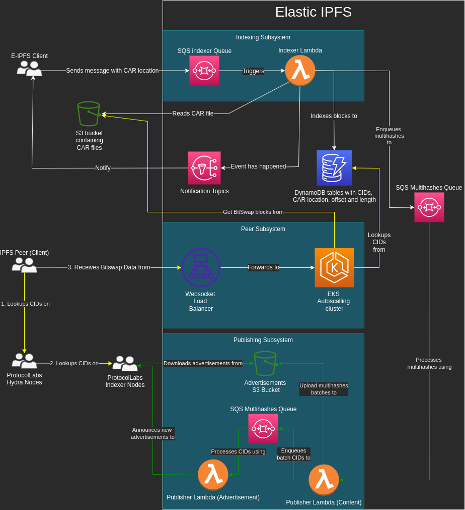
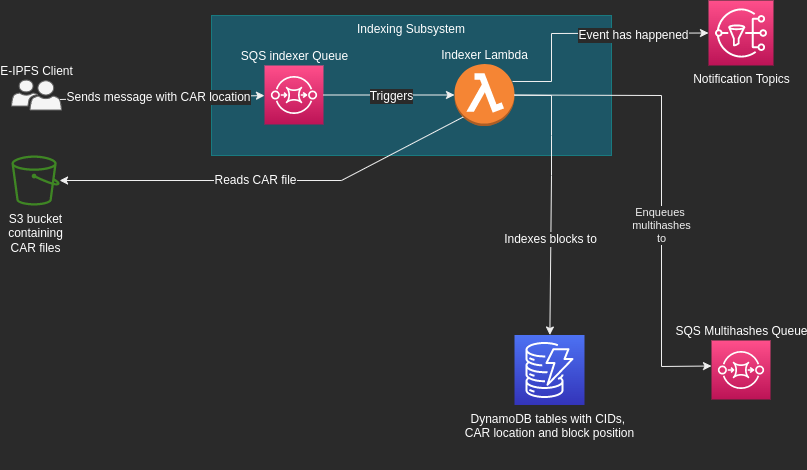
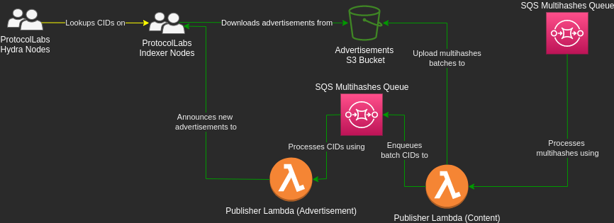
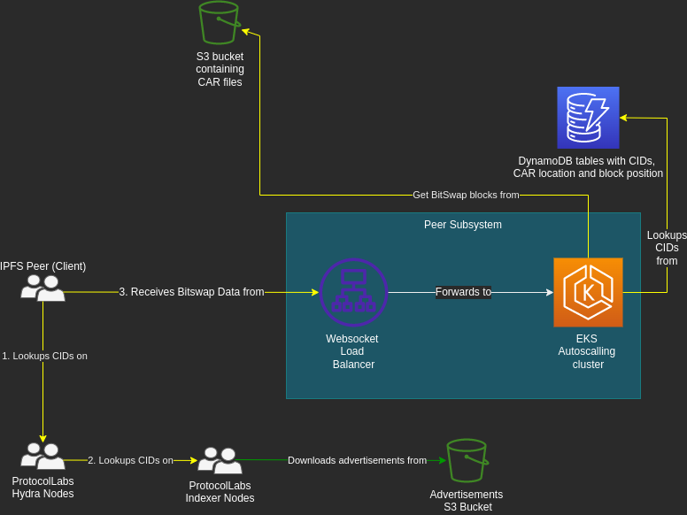
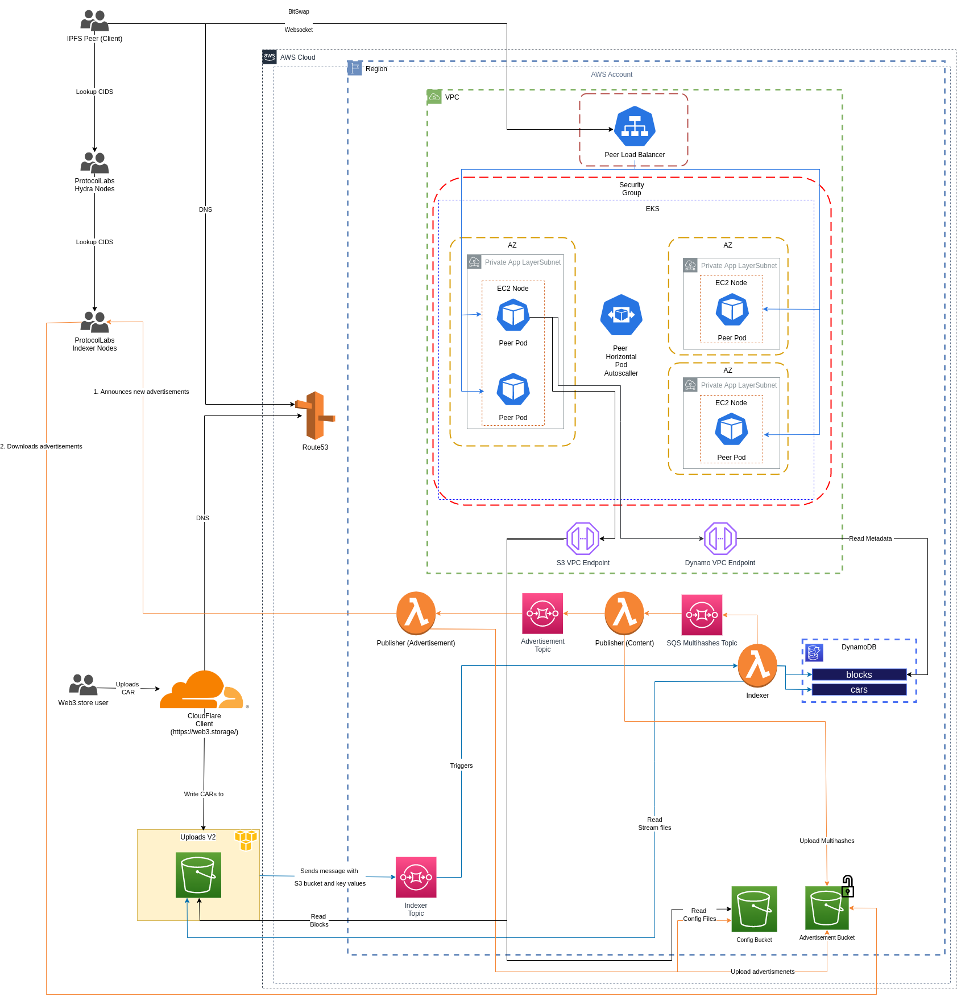

# ipfs-elastic-provider
A cloud native IPFS node

## Assumptions

The first version of [IPFS Elastic Provider](https://www.notion.so/IPFS-Elastic-Provider-5ebc108219054f608b0ddd3a20122b63)  does **NOT** need to:

- Re-provide into the DHT - content-discovery is delegated to a combination of hydra-booster and storetheindex nodes
- Provide over multiple transports - WebSocket only
- Provide data from other peers in the network - if the data isn’t stored in a CAR file that [IPFS Elastic Provider](https://www.notion.so/IPFS-Elastic-Provider-5ebc108219054f608b0ddd3a20122b63)  has previously indexed, then it will not try to fetch from other peers.
- Pin requests are not handled by this system

## Simplified architecture

## Components

### Indexing subsystem

#### Description

This subsystem is responsible for the ingestion of the data sent to any bucket, as long as it has the required read policies configured.

The lambda is triggered by receiving messages in SQS Indexer Topic. Each file to be indexed is a message which contains the following: bucket region, bucket name and file key. It starts streaming the CAR file from S3, updating progress on the **cars DynamoDB Table**. If there is already partial progress for the file, then the operation is resumed (this allows error recovery). If the file has already been analyzed completely, then it is skipped and the lambda ends.

For each block present in the CAR, in the **blocks DynamoDB Table** the lambda stores the block type and the position information (offset and length) for the current CAR file. The table is indexed using the **multihash**, not the entire CID. If the block is already in the table, then the position information is appended to existing position for other CAR files. Positions are sorted putting leftmost positions at the beginning of the list, since this will result in faster serving in the peer subsystem (see below).

For each block present in the CAR, after DynamoDB informations are stored, the lambda also publishes the multihash to the M**ultihashes SQS topic**.

### Publishing subsystem

#### Description

This subsystem takes care of the discovery part of the IPFS stack. In order to do this, it relies on the existence of already deployed [storetheindex nodes](https://github.com/filecoin-project/storetheindex) and [hydra-booster node](https://github.com/libp2p/hydra-booster)s.

The **[Publishing Lambda](https://github.com/web3-storage/AWS-IPFS-publishing-lambda)** is deployed twice, with two different phases and different handlers (controlled via environment variable).

The first phase, called **Content**, consumes messages (which are multihashes) from the M**ultihashes SQS topic** (fed by Indexer Lambda). Messages are consumed in batches on 10000 maximum length. Each batch is uploaded as an entries file (DAG-JSON) on the **Advertisement S3 Bucket**. The CID of the file is published to the **Advertisement SQS topic**.

The second phase, called **Advertisement**, consumes messages from the **Advertisement SQS topic** and uploads new advertisement in order (keeping a link to the previous one) to the **Advertisement S3 Bucket**.

Once the batch has been completely consumed, the lambda finally updates the **head** DAG-JSON file on the bucket.

Finally, the lambda announces that the head has changed to the **storetheindex node**.

**For the architecture to work properly, the Advertisement phase must be configured to have maximum concurrency of one, to avoid concurrent head link update which result in lost announcements if the update chain is broken.**

The **storetheindex node** will in the future, with its own policies, download advertisement directly from **Advertisement S3 Bucket.**

The **hydra-booster nodes** will lookup content in the indexer nodes and this makes indexed data discoverable by regular IPFS via DHT. 

### Peer subsystem

#### Description

A regular IPFS peer relies on hydra-booster nodes (and therefore storetheindex nodes) to discover the location of data.

Once the data is discovered, the peer will request data to the **[Peer Subsystem](https://github.com/web3-storage/AWS-IPFS-bitswap-peer)**, which is deployed as an **EKS Autoscaling Cluster** with a **WebSocket ELB** on front.

The BitSwap peer will lookup the multihashes in the **blocks DynamoDB Table**. If there is no match, then a **DONT_HAVE** reply is immediately sent back to the remote peer. **The BitSwap peer never tries to download requested data from other peers.**

If there is a match, the BitSwap peer will immediately send the block to the remote peer. It will use position informations stored in DynamoDB to perform a range S3 reading from the bucket and will forward the data to the remote peer without saving it locally. 

## Additional notes

For the architecture to work properly, the **Publishing Subsystem** and the **Peer Subsystem** must use the same peer information and keys. To achieve this, both system will download a JSON serialized peer from a separate **Configuration S3 bucket**. The configuration of this feature is achieved on both components using environment variables.

For the storetheindex nodes to be able to download advertisements without additional serving components, the **Advertisements S3 Bucket** and all its content must be publicly accessible.

## Detailed infrastructure architecture

