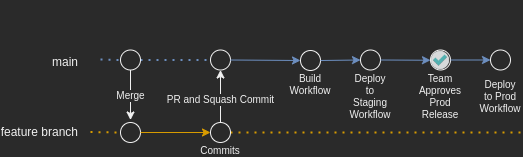
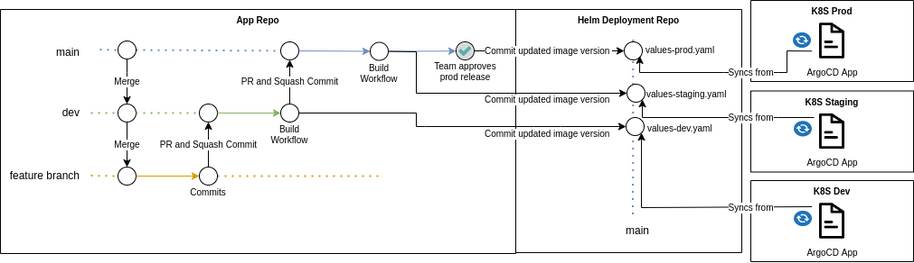

# CI/CD Workflows

All Elastic Provider component repositories follow the [Feature Branch Workflow strategy](https://www.atlassian.com/git/tutorials/comparing-workflows/feature-branch-workflow). They can have any number of short-lived feature branches and a single long-lived branch, which is `main`. All PRs should be targetting `main`.

## Build Workflow

When new changes are introduced to the long-lived branch, they trigger a build workflow.

It will have at least these major steps:

```
Run Test => Run Lint => Build Artifact (Docker Image) => Publish Artifact
```

### PR

 All pull requests from a feature branch to `main` also trigger a workflow. It has the same steps described above, except for the last one: it doesn't publish any artifacts. The focus is validation and quality. This guarantees a **fail fast** strategy, making possible to identify problems as soon as possible.

 ```
Run Test => Run Lint => Build Artifact (Docker Image)
```


 ## Deploy Workflow

 This is triggered when a build workflow has finished running successfully for the `main` branch, which is associated with the environments that should be updated.

- main: Staging (Automatic) and Prod (Requires manual approval)

The steps for it will vary depending if component should be deployed to a lambda or Kubernetes.

 ### Lambda

This diagram shows the complete process of introducing a new feature for a lambda into all environments.



This is the main step
 ```
Run Deploy
```

That step means that after the AWS credentials have been properly configured, the lambda update-function-code is executed with the docker image tag that has been provided by `build workflow`.

#### Security 

[AWS is configured to trust GitHub's OIDC](https://docs.github.com/en/actions/deployment/security-hardening-your-deployments/configuring-openid-connect-in-amazon-web-services). That means repos work with tokens instead of storing long-lived AWS credentials in secrets.


 ### Kubernetes

 This diagram shows the complete process of introducing a new feature for an application running in Kubernetes into different environments.



Applications which run on Kubernetes have their specs managed by helm charts. Those are stored in another repo with `**-deployment` sufix. Example: [`bitswap-peer`](https://github.com/elastic-ipfs/bitswap-peer) has a correspondent [`bitswap-peer-deployment`](https://github.com/elastic-ipfs/bitswap-peer-deployment) repo. 

To start an upgrade, the image tag specified in deployment repo must be changed. Use the targeted image version, which was generated and published during build workflow. This is done through PR review and approval process.

This follows a [GitOps Pull Model approach](https://dzone.com/articles/why-is-a-pull-vs-a-push-pipeline-important), which means that GH doesn't push to K8S.

ArgoCD is running inside the cluster monitoring possible changes on its correspondent environment spec. For example: ArgoCD in K8S staging is always syncing with `values-staging.yaml` file.

When an image tag is updated in the `values-<env>.yaml` file, ArgoCD automatically knows  how to change the `deployment` spec, so that new pods can be created.


#### Security

There is no need of configuring any kind of access from GitHub, it stores zero long or short lived credentials.


## Shared Workflows

[This repo](https://github.com/elastic-ipfs/shared-workflows) stores generic workflows that are reused by several components.

## Important Notes

- Keep `staging` and `prod` environments as sync as possible. Remember you **can't** add new code that is just for `prod` without releasing everything that's deployed in `staging`.
- Don't forget to merge/rebase from the target branch when doing PR.
